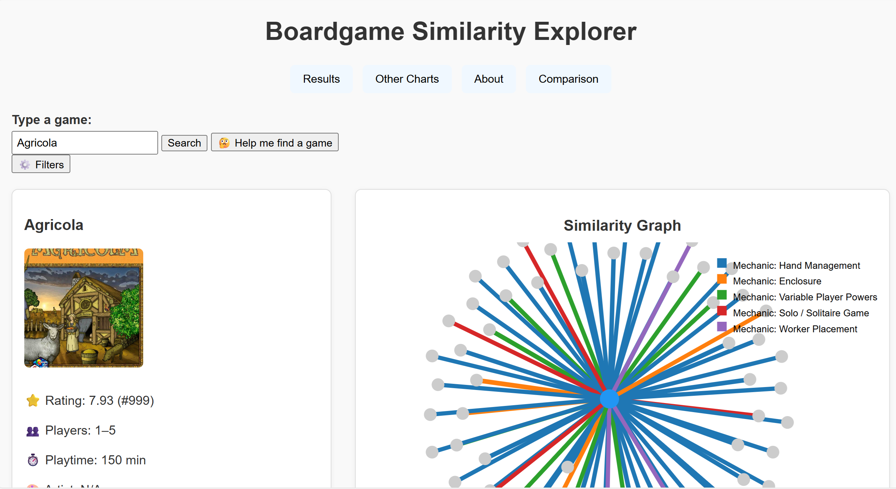

Boardgame Matching Similarity Score Explorer

Description

This project builds an interactive visualization tool to explore the similarity between board games using machine learning techniques and graph-based methods.
The system processes a dataset of board games, computes feature vectors for each game (based on mechanics, categories, ratings, and metadata), and then uses cosine similarity to determine how closely related two games are.

The final output is an interactive force-directed graph where:

Each node represents a board game.

Edges connect games with high similarity scores.

Clicking a game highlights its neighborhood and shows detailed similarity comparisons.

A complementary panel displays pairwise similarity metrics and metadata.

This tool helps users discover new games similar to ones they already enjoy, analyze clusters of game types, and visually understand the structure of the board-game ecosystem.

Data Source: https://www.kaggle.com/datasets/threnjen/board-games-database-from-boardgamegeek?resource=download