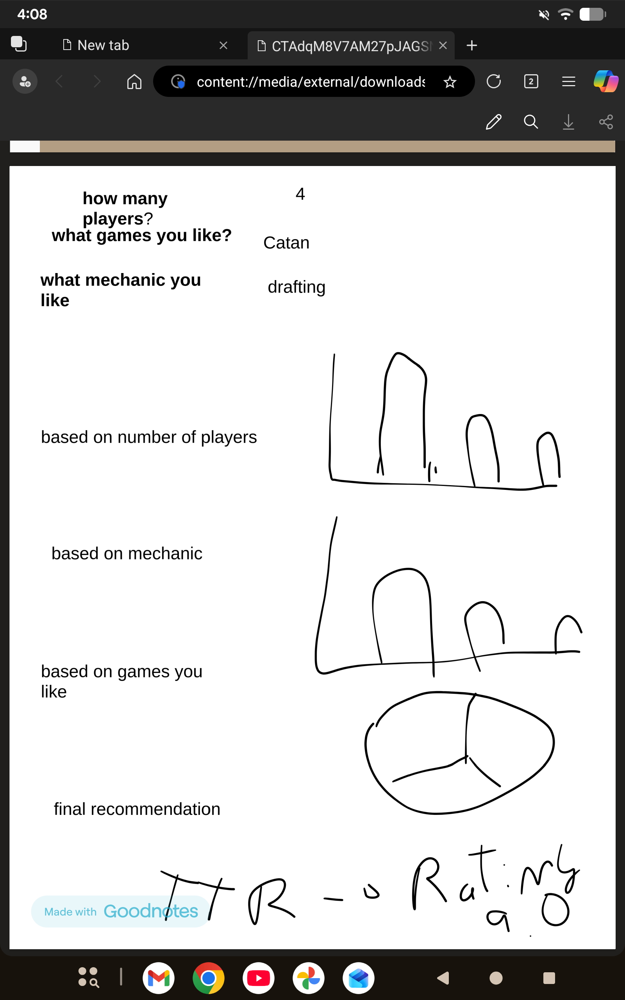

# Alejandro Armas

## Description

Im trying to make a visual interactive using boardgamegeek databases of boardgame which based on your preferences about number of players, mechanics you like, game you have played before, etc it can display several recommendations.
## Technical Plan re: Option A/B/C/D

{
Im thinking of using path A, with a lot of options on what you want out of the result. Im planning on using some machine learning model library like scikit learn to predict the best game recommendation for you. 
The visualizations so far, using javascript and altair, maybe another one that is better suited for this idea.

## Mockup

## Data Sources

### Data Source 1: Kaggle Databases

URL: https://www.kaggle.com/datasets/threnjen/board-games-database-from-boardgamegeek/data)}

Size: 21521 rows, 48 columns

They have lots of information about the games, which can be better in other to be able to group them together in some clustering kinda way which allows to make good recommendations
## Questions

{Numbered list of questions for course staff, if any.}

1. Any suggestion in how it can be better visualize Im super open to ideas
2. Is this enough for the large interactive path or should I try to make it into something like the path b
3.